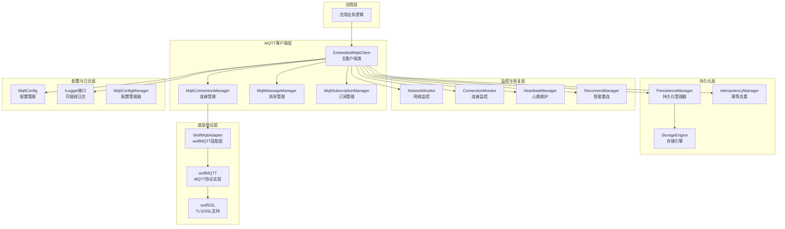
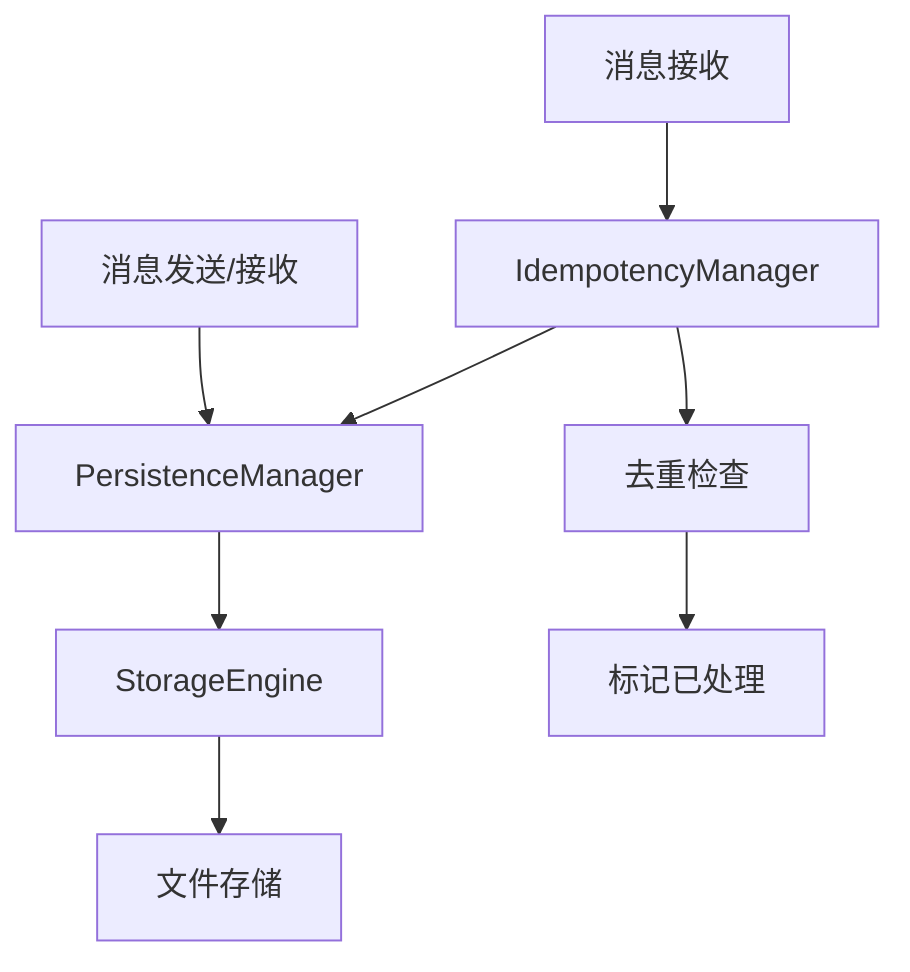
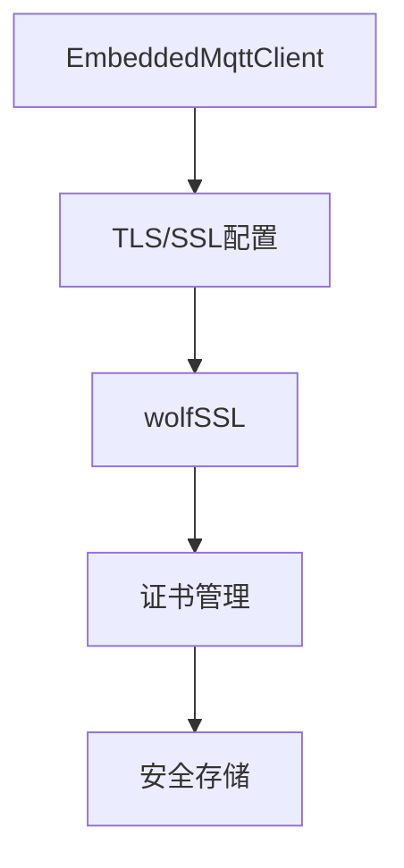
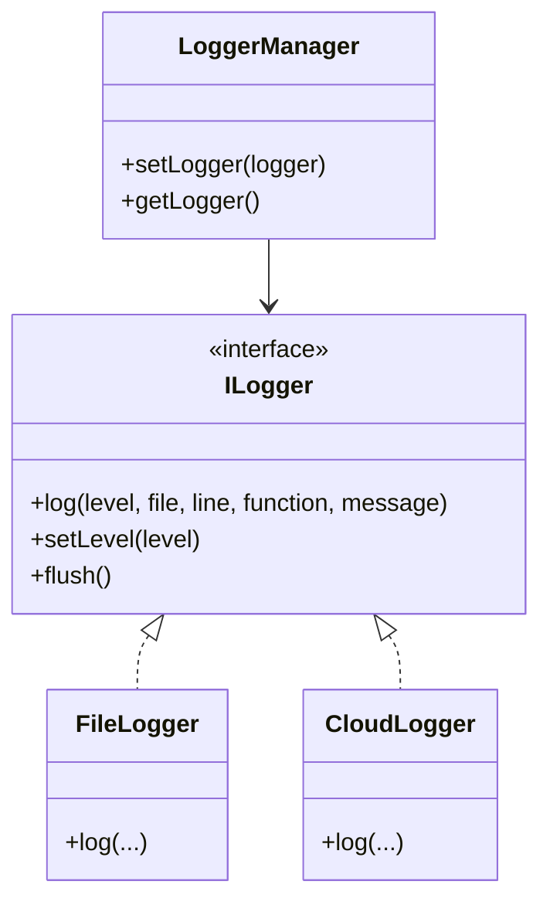

# 嵌入式MQTT客户端架构设计文档

[TOC]

---

## 设计目标与原则

### 业务约束

- **设备规模**: 3000台PLC设备
- **运行要求**: 7×24小时不间断运行
- **网络环境**: 4G网络，弱网、断网常见
- **资源限制**: 
  - 内存: ~50MB总内存
  - CPU: 单核/双核ARM
  - 存储: 有限的闪存空间

### 技术目标

- ✅ 支持MQTT 5.0协议（默认，推荐）
- ✅ 支持MQTT 3.1.1协议（兼容旧服务器）
- ✅ 实现智能重连机制（指数退避+随机抖动）
- ✅ 三层监控体系（网络/连接/心跳）
- ✅ 会话保持和消息可靠性
- ✅ QoS分级策略
- ✅ 遗嘱消息支持
- ✅ 内存占用<10MB
- ✅ CPU占用<5%（空闲时）

### 设计原则

1. **可靠性优先**: 7×24小时稳定运行，消息不丢失
2. **资源高效**: 最小化内存和CPU占用
3. **可维护性**: 清晰的模块划分，易于扩展
4. **线程安全**: 多线程环境下的正确性和稳定性
5. **可配置性**: 灵活的配置机制，支持运行时调整
6. **可观测性**: 完善的日志和监控机制

---

## 整体架构

### 架构分层图



### 架构特点

| 特性 | 设计选择 | 说明 |
|------|---------|------|
| **架构模式** | 回调驱动 | 简化架构，降低复杂度 |
| **并发模型** | 固定线程数(3-5个) | 减少资源开销 |
| **内存管理** | RAII+智能指针 | 避免内存泄漏 |
| **配置方式** | JSON+运行时配置 | 支持延迟初始化和热更新 |
| **日志系统** | 可插拔接口 | 支持用户自定义（云日志等） |
| **错误处理** | Result<T>模式 | 不使用C++异常，适合嵌入式环境 |

### 物理目录边界

- `include/mqtt_client/` 只包含对使用者承诺的公共头文件：主客户端、配置、核心类型、日志接口和指标。
- `src/internal/` 包含连接、消息、订阅、监控、重连、持久化以及 wolfMQTT 适配器的内部头文件；这些文件只供库实现和内部测试使用，不会安装到公共 include 目录。
- `src/` 中的 `.cpp` 文件实现公共外观和内部模块，依赖方向由库内部指向公共契约，应用侧不需要了解管理器或第三方 SDK 类型。

---

## 核心组件设计

### 1. EmbeddedMqttClient - 主客户端类

**职责**：
- 封装所有MQTT功能，提供统一接口
- 管理连接生命周期
- 协调各个子模块
- 支持MQTT 3.1.1和5.0协议

**关键接口**：
```cpp
class EmbeddedMqttClient {
public:
    // 初始化和配置
    Result<bool> initialize(const MqttConfig& config);
    Result<bool> updateConfig(const MqttConfig& config);
    
    // 连接管理
    Result<bool> connect();
    Result<bool> disconnect(bool force = false);
    
    // 消息发布
    Result<bool> publish(const std::string& topic, 
                         const std::string& payload,
                         QoS qos = QoS::QOS_0,
                         bool retain = false);
    
    // 消息订阅
    Result<bool> subscribe(const std::string& topic,
                          MessageCallback callback,
                          QoS qos = QoS::QOS_0);
    
    // 回调设置
    void setConnectionCallback(ConnectionCallback callback);
    void setErrorCallback(ErrorCallback callback);
};
```

### 2. MqttConnectionManager - 连接管理器

**职责**：
- 管理MQTT连接生命周期
- 处理连接、断开、重连
- 维护连接状态

### 3. MqttMessageManager - 消息管理器

**职责**：
- 管理消息发布队列
- 实现消息重试机制
- 支持消息优先级

### 4. MqttSubscriptionManager - 订阅管理器

**职责**：
- 管理主题订阅
- 消息分发和回调
- 支持通配符匹配

### 5. ReconnectManager - 重连管理器

**职责**：
- 智能重连策略（指数退避+随机抖动）
- 自动重连机制
- 重连状态管理

### 6. 监控组件

- **NetworkMonitor**: 网络状态监控（5秒间隔）
- **ConnectionMonitor**: 连接状态监控（10秒间隔）
- **HeartbeatManager**: 心跳维护（30秒间隔）

---

## 配置管理

### 配置结构

```cpp
struct MqttConfig {
    // 基础配置
    struct BasicConfig {
        std::string version = "5.0";        // "3.1.1" 或 "5.0"
        std::string clientId;
        bool cleanStart = false;
    } basic;
    
    // 服务器配置
    struct ServerConfig {
        std::string host;
        int port = 1883;
        bool useSSL = false;
        int connectTimeout = 30;
        int keepAlive = 60;
    } server;
    
    // 认证配置
    struct AuthConfig {
        std::string username;
        std::string password;
    } auth;
    
    // MQTT 5.0配置（仅当version="5.0"时生效）
    struct Mqtt5Config {
        int sessionExpiryInterval = 7200;
        int receiveMaximum = 100;
        std::map<std::string, std::string> userProperties;
        // ... 其他MQTT 5.0属性
    } mqtt5;
    
    // 重连配置
    struct ReconnectConfig {
        bool enableAutoReconnect = true;
        int maxAttempts = -1;  // -1表示无限重试
        int initialDelay = 1;
        int maxDelay = 300;
    } reconnect;
    
    // 持久化配置
    struct PersistenceConfig {
        struct StorageConfig {
            std::string storagePath = "./data";
        } storage;
        
        struct IdempotencyConfig {
            bool enableIdempotency = true;
            time_t retentionTime = 5 * 60;  // 5分钟
        } idempotency;
    } persistence;
    
    // 监控配置
    struct MonitoringConfig {
        bool enableNetworkMonitor = true;
        bool enableConnectionMonitor = true;
        bool enableHeartbeat = true;
    } monitoring;
};
```

### 配置管理特性

- **统一管理**: 通过`MqttConfigManager`统一管理
- **配置验证**: 加载时自动验证配置有效性
- **热更新**: 支持运行时配置更新（部分配置）
- **多格式支持**: 支持JSON格式
- **默认值**: 提供合理的默认配置

---

## 线程安全设计

### 线程安全级别

```cpp
enum class ThreadSafetyLevel {
    NOT_THREAD_SAFE,           // 线程不安全
    READ_ONLY_THREAD_SAFE,     // 只读线程安全
    FULLY_THREAD_SAFE,         // 完全线程安全
    LOCK_FREE_THREAD_SAFE      // 无锁线程安全
};
```

### 锁机制

- **互斥锁（std::mutex）**: 保护共享数据的读写
- **读写锁（std::shared_mutex）**: 读多写少场景
- **原子操作（std::atomic）**: 简单状态标志
- **锁顺序**: 统一锁顺序，避免死锁

### 线程安全保证

| 组件 | 线程安全级别 | 说明 |
|------|------------|------|
| EmbeddedMqttClient | FULLY_THREAD_SAFE | 所有公共接口线程安全 |
| MqttConnectionManager | FULLY_THREAD_SAFE | 内部使用互斥锁保护 |
| MqttMessageManager | FULLY_THREAD_SAFE | 消息队列线程安全 |
| MqttSubscriptionManager | FULLY_THREAD_SAFE | 订阅列表线程安全 |
| MqttConfig | READ_ONLY_THREAD_SAFE | 配置对象只读线程安全 |

---

## 持久化与幂等去重

### 持久化架构



### 持久化组件

#### 1. StorageEngine - 存储引擎

- **文件存储**: 基于文件系统的JSON存储
- **原子写入**: 临时文件+重命名，保证数据完整性
- **目录管理**: 自动创建存储目录

#### 2. PersistenceManager - 持久化管理器

**功能**：
- 发送队列持久化
- 接收队列持久化
- 订阅信息持久化
- 客户端状态持久化
- 幂等去重记录持久化
- 快速恢复机制

#### 3. IdempotencyManager - 幂等去重管理器

**功能**：
- SHA-256消息hash计算
- 去重检查（`isDuplicate`）
- 标记已处理（`markProcessed`）
- 自动清理过期数据（后台线程）
- 持久化支持（服务重启后恢复）

**去重策略**：
- 基于消息hash值（topic + payload + qos）
- 默认保留时间：5分钟
- 自动清理过期记录

---

## 安全管理

### 安全架构



### 安全特性

1. **TLS/SSL支持**
   - 通过wolfSSL提供TLS/SSL加密
   - 支持证书验证
   - 支持无CA证书模式（开发测试）

2. **证书管理**
   - 证书加载和验证
   - 证书存储（加密存储）

3. **认证机制**
   - 用户名/密码认证
   - Token认证（可选）

---

## 错误处理机制

### 错误码体系

```cpp
enum class MqttErrorCode : int {
    SUCCESS = 0,
    
    // 系统错误 (1-99)
    SYSTEM_ERROR = 1,
    SYSTEM_RESOURCE_EXHAUSTED = 2,
    
    // 网络错误 (100-199)
    NETWORK_ERROR = 100,
    NETWORK_TIMEOUT = 102,
    
    // 连接错误 (200-299)
    CONNECTION_ERROR = 200,
    CONNECTION_FAILED = 201,
    CONNECTION_LOST = 202,
    
    // 认证错误 (300-399)
    AUTH_ERROR = 300,
    AUTH_FAILED = 301,
    
    // 协议错误 (400-499)
    PROTOCOL_ERROR = 400,
    
    // ... 其他错误码
};
```

### 错误处理原则

1. **不使用C++异常**: 嵌入式环境最佳实践
2. **统一错误码**: 所有错误使用统一的错误码体系
3. **Result<T>模式**: 使用`Result<T>`封装返回值
4. **错误回调**: 支持错误回调机制
5. **优雅降级**: 错误发生时能够优雅降级，继续运行

### Result<T>模式

```cpp
template<typename T>
class Result {
public:
    static Result<T> Success(const T& value);
    static Result<T> Failure(const MqttError& error);
    
    bool success;
    T value;
    MqttError error;
};
```

---

## 日志系统

### 可插拔日志架构



### 日志接口

```cpp
class ILogger {
public:
    virtual ~ILogger() = default;
    virtual void log(LogLevel level,
                    const std::string& file,
                    int line,
                    const std::string& function,
                    const std::string& message) = 0;
    virtual void setLevel(LogLevel level) = 0;
    virtual void flush() = 0;
};
```

### 日志级别

- **TRACE**: 跟踪级别（最详细）
- **DEBUG**: 调试级别
- **INFO**: 信息级别
- **WARN**: 警告级别
- **ERROR**: 错误级别
- **FATAL**: 致命级别

### 使用方式

```cpp
// 使用默认文件日志
LoggerManager::getInstance().useDefaultFileLogger("./logs/mqtt.log");

// 使用自定义日志（如云日志）
auto cloudLogger = std::make_shared<CloudLogger>(...);
LoggerManager::getInstance().setLogger(cloudLogger);
```

---

## 性能优化策略

### 性能目标

| 指标 | 目标值 |
|------|--------|
| 内存占用 | <10MB |
| CPU占用（空闲） | <5% |
| CPU占用（发送心跳） | <10% |
| CPU占用（接收消息） | <15% |

### 优化策略

1. **消息批量处理**
   - 批量发送消息，减少网络往返
   - 批量大小和延迟可配置

2. **零拷贝优化**
   - 避免不必要的内存拷贝
   - 使用引用传递

3. **内存池和对象池**
   - 减少内存分配开销
   - 对象复用

4. **网络I/O优化**
   - 使用epoll/kqueue（Linux/macOS）
   - 非阻塞I/O

5. **编译时优化**
   - 使用-O2/-O3优化
   - 链接时优化（LTO）

---

## 资源管理

### 资源管理原则

1. **RAII原则**: 资源获取即初始化，自动管理生命周期
2. **智能指针**: 使用`std::unique_ptr`和`std::shared_ptr`
3. **资源限制**: 设置资源上限，防止资源耗尽
4. **资源监控**: 实时监控资源使用情况

### 资源类型

- **内存资源**: 内存分配和释放跟踪
- **文件描述符**: Socket和文件句柄管理
- **线程资源**: 线程创建和销毁管理

---

## wolfMQTT集成

### 集成架构

```
EmbeddedMqttClient (封装层)
    ↓
WolfMqttAdapter (适配层)
    ↓
wolfMQTT (底层库)
    ↓
wolfSSL (TLS支持)
```

### 适配层设计

**WolfMqttAdapter**负责：
- 封装wolfMQTT API
- 协议版本选择（3.1.1/5.0）
- 连接参数转换
- 网络抽象层实现
- TLS/SSL配置

### 命名规范

- **封装类**: `mqtt_client::EmbeddedMqttClient`
- **wolfMQTT类**: `wolfmqtt::MqttClient`（使用命名空间区分）

---

## 构建与依赖

### 依赖库

- **wolfMQTT**: MQTT协议实现（Git Submodule）
- **wolfSSL**: TLS/SSL支持（可选）
- **nlohmann/json**: JSON解析（FetchContent）

### 构建要求

- **CMake**: >= 3.15
- **C++标准**: C++17
- **编译器**: GCC 7+, Clang 5+, MSVC 2017+

### 构建步骤

```bash
# 1. 克隆仓库
git clone <repository>
cd libmqtt-client

# 2. 运行初始化脚本（自动初始化 submodules 和构建 wolfMQTT）
./scripts/unix/init.sh

# 3. 构建项目
./scripts/unix/build.sh

# 或使用跨平台 Python 脚本（推荐）
./scripts/unix/build.sh
```

---

## 总结

本架构设计文档涵盖了嵌入式MQTT客户端框架的所有核心设计内容，包括：

- ✅ 整体架构和组件设计
- ✅ 配置管理机制
- ✅ 线程安全保证
- ✅ 持久化和幂等去重
- ✅ 安全管理
- ✅ 错误处理机制
- ✅ 日志系统
- ✅ 性能优化策略
- ✅ 资源管理
- ✅ wolfMQTT集成

所有设计都遵循**可靠性优先**、**资源高效**、**可维护性**的原则，确保在资源受限的嵌入式环境下能够稳定、高效地运行。

---

**相关文档**：
- [API接口设计](API_DESIGN.md) - 完整的API接口清单和定义
